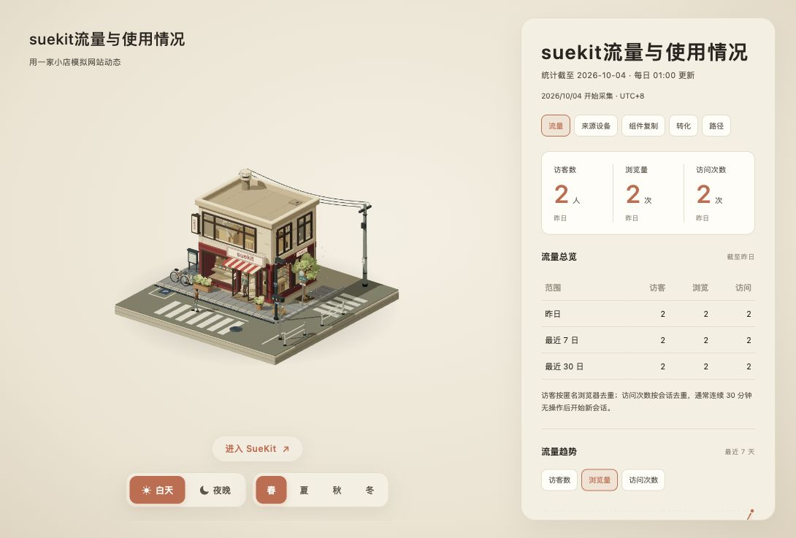

# SueKit Virtual Shop

用一家可切换四季与昼夜的三维微缩小店，展示 SueKit 的流量与工具使用情况。

[访问网站](https://yisu0830.github.io/suekit-virtual-shop/) · [进入 SueKit](https://suekit.jiongxiaosu0830.workers.dev/)



### 使用限制

本项目源码公开，仅供非商业学习、研究及个人使用。

禁止任何商业用途，包括但不限于：售卖代码或其修改版本、搭建或提供收费产品或服务，以及用于企业商业运营。

本声明不授予项目中第三方素材的使用权，相关素材应遵守其各自的授权条款。

## 文件结构

| 文件或目录 | 用途 |
| --- | --- |
| `index.html` | 唯一的网站入口，由源码构建生成，供 GitHub Pages 发布 |
| `rainy-corner-src/` | 三维模型、交互、统计面板样式和构建程序 |
| `analytics-service/` | 每日统计服务、查询定义和服务测试 |
| `analytics.json` | 随页面打包的统计快照，用于本地打开及初始展示 |
| `preview.jpg` | 当前网站截图；统计数值以实际网站为准 |

## 本地查看与构建

直接打开 `index.html` 可查看内置快照。通过 HTTP 访问时，页面会读取线上每日统计。

需要修改页面时，编辑 `rainy-corner-src/` 中的源码，然后执行：

```sh
cd rainy-corner-src
npm ci
npm run build
```

构建只生成根目录的 `index.html`，不再生成重复页面。

## 统计与隐私

当前统计来源为 PostHog，由独立服务每日 UTC+8 01:00 更新，详情见 [统计服务说明](analytics-service/README.md)。页面内的 `analytics.json` 是备用快照，不会随每日服务更新自动改写。

网站统计接口公开提供汇总指标，包括流量、来源设备、组件复制、转化及汇总访问路径。源码公开和禁止商用声明都不会限制这些指标的读取。

后台读取密钥由服务端环境变量 `POSTHOG_READ_KEY` 提供，不应写入源码、前端页面或提交记录。本仓库忽略依赖目录、本地环境文件和部署缓存。

### 小店网站自身的访问统计

小店接入同一个 PostHog 项目（645031），每次打开生产页面记录一次 `$pageview`，事件标记为 `app = suekit-virtual-shop`。在 PostHog Web Analytics 按此属性或 URL 路径 `/suekit-virtual-shop/` 筛选，可查看小店的浏览量、访客、会话与来源。SueKit 主站继续使用 `app = suekit`，页面内展示的主站统计不受影响。

统计脚本由 `rainy-corner-src/analytics-snippet.html` 在构建时嵌入页面，仅在 GitHub Pages 的小店路径运行，本地预览不记录。关闭自动点击采集、会话录像和人物档案，URL 与来源 URL 去除查询参数和片段。访问数据从接入上线后开始累积，无法补回此前的访问。
